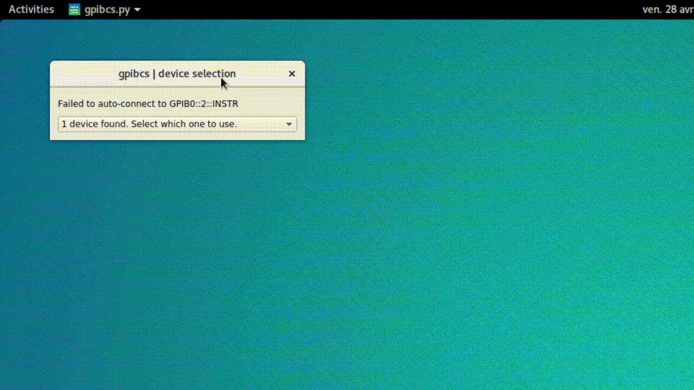
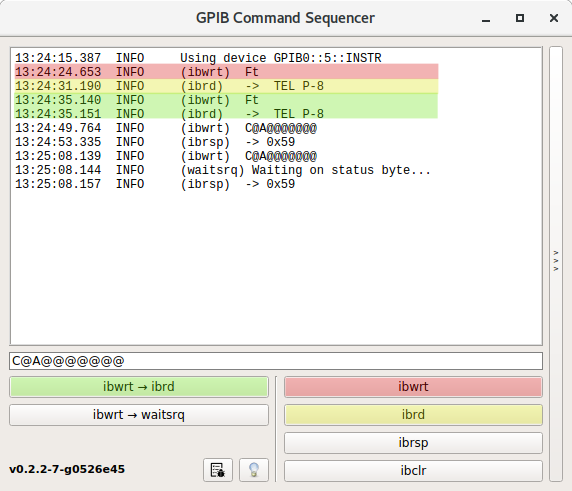
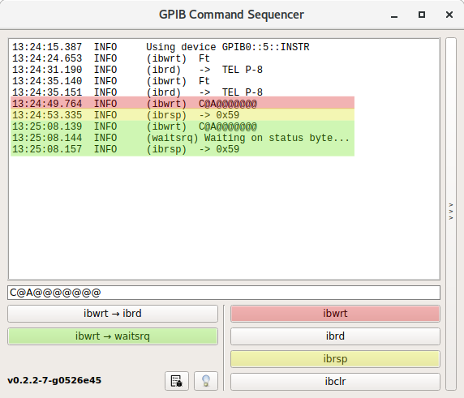
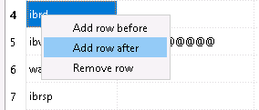
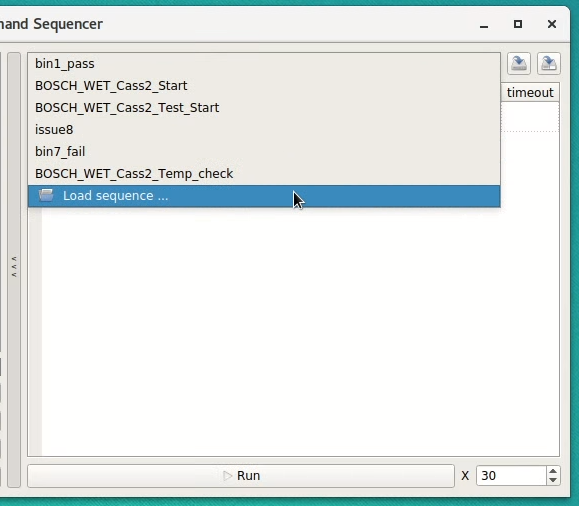
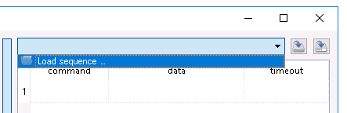
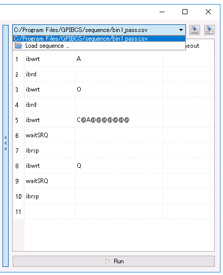
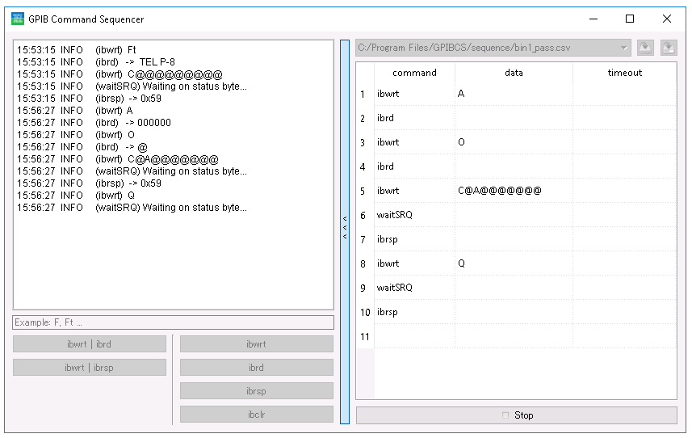

# TEL GPIBCS

## 1. Scope
`GPIBCS` stands for *General Purpose Interface Bus Command Sequencer*. As such, the scope of this software is to provide a graphical way of issuing single or a sequence of `GPIB` commands to a TEL Prober (officially tested) or any other GPIB capable device (untested).

This software is by no means a fully-automatic tester simulator and does not offer support for sequence control flow typically provided by if/for/while statements. Complex workflows must be reduced to smaller linear sequences meaning that control flow decisions are made by the user in between sequence executions. To user interface of the sequencer is designed so that the sequences may be quickly loaded and changed.

## 2. Installation

### 2.a. Windows
Double click on the `gpibcs.msi` installer. It will automatically install GPIBCS under `C:\Program Files\GPIBCS` and add a Start Menu entry.

### 2.b. Linux
No package is currently being offered for Linux but it is the platform of choice for devleopment. Please refer to the main [README.md](https://github.com/buha/gpibcs) for Linux development instructions.

## 3. Usage

### 3.a. Device Configuration
When launched,`gpibcs` will attempt to automatically use a device specified in the configuration file `gpibcs.conf`. On success the main window is displayed, otherwise you will be presented with this device selection dialog. Simply select a device to use it.


One typically works with only one device and wants to bypass device selection. You can achieve this by manipulating the relevant parameter in the configuration file. The example shown below configures `gpibcs` to use the device with primary address `5` of the board `0`. The board number is typically zero, unless you have more boards connected, in which case it increases.
```
gpibDevice = GPIB0::5::INSTR
```
### 3.b. GPIB commands
A typical use case is a write followed by a read. By writing `Ft` and reading the response on can get the TEL prober model. Click `ibwrt` first, and `ibrd` secondly. This frequently used sequence can also be accomplished using the button `ibwrt->ibrd`.


Commands that require a wait on a particular SRQ can accomplished manually by an `ibwrt` followed by repeated clicks on `ibrsp` until the desired SRQ is received. The equivalent action can be performed by pressing the equivalent `ibwrt->waitsrq` button.


### GPIB command sequences
Clicking on the side button exposes the sequence panel. You can load, edit, save and execute GPIB command sequences from this panel.

To **edit** command sequences, double click in an empty cell of the table and start typing. You can also insert/remove rows by right clicking anywhere in the table to get a context menu with such choices.


The sequence table contains 3 columns: **command**, **data** and **timeout**. Hover the mouse over any of the table headers to get hints of what should you insert into each, what are the measurement units etc.

To **save** the sequence for future use click **Save** or **Save As** icons in the top right and choose a destionation file in *.csv* format.


To **load** a sequence, click on the sequence selection combo box and select `Load sequence...`. Pick for example `bin1_pass.csv` and the file contents will be displayed in the sequence table.



Once you're happy with your sequence you can run it by clicking on `Run`. Note that a sequence can be repeated for a specified number of times using the sequence multiplier. You can stop the execution of any command by clicking the stop button while a sequence's execution is pending.



## 4. User interface tips
* Some items are documented using mouse hover hints, make sure to use this feature.
* You can browse the sequence selector using the keyboard navigation arrows when the selector is in focus.

## 5. Configuration parameters
* Section `logging`
`logfilename` - log file name [default: gpibcs.log]
`logfilesize` - log file size measured in kilobytes [default: 102400]
`logfilelevel` - level of details in the file [default: 1]  (1 - highest, 5 - lowest)
`logconsolelevel` - level of details on the GUI console [default: 2] (1 - highest, 5 - lowest)

* Section `gpib`
`gpibdevice` - default device to use in the format GPIBx::y::INSTR where x is the dongle number (incremental from zero) and y is the primary address configured on the prober. Leave blank to ask for device selection each time.
`gpibtimeout` - GPIB bus timeout in seconds [default: 3]

* Section `gui`
`lastuseddir` - last used directory when loading sequences. It is overwritten on exit.
`autoloaddirs` - by setting this to a comma separated list of directories, the sequences within the directories will show up in the selection drop-down list

## Contact
For any bug reports or feature requests please contact darius.berghe@europe.tel.com.


