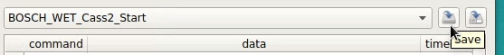

# TEL GPIBCS
*This document covers version v0.1.0 of the software*
## 1. Scope
`GPIBCS` stands for *General Purpose Interface Bus Command Sequencer*. As such, the scope of this software is to provide a graphical way of issuing single or a sequence of `GPIB` commands to a TEL Prober.

This software is by no means a fully-automatic tester simulator and does no offer support for sequence control flow typically provided by if/for/while statements. Complicated workflows must be reduced to simpler sequences that do not require such statements.

## 2. Installation
Double click on the `gpibcs.msi` installer. It will automatically install GPIBCS under `C:\Program Files\GPIBCS` and add a Start Menu entry.

## 3. Usage

### Device Configuration
If `GPIBCS` is started without any GPIB device connected, the interface will simply show an error message and quit.


When launched, `GPIBCS` relies on information in `C:\Program Files\GPIBCS\gpibcs.conf` in order to connect to a specific device. Please modify the file accordingly to allow connection to your devices. The configuration parameter below means that `GPIBCS` should connect to the device with primary address `5` of the board `0`. The board number is typically zero, unless you have more boards connected, in which case it increases.
```
gpibDevice = GPIB0::5::INSTR
```
Provided that there is at least one other device connected, the message will contain their address which you can then replace in the `gpibcs.conf` file.


### GPIB commands
After correctly configuring `GPIBCS`, you will be presented with thie following screen. You can write any command in the command input box because TEL commands comprised only of printable ASCII characters. For this example, we use the command `Ft` which retrieves the prober model using a sequence of `ibwrt` and `ibrd`. Click `ibwrt` first, and `ibrd` secondly.
 

Commands that require a wait on a particular SRQ can accomplished manually by an `ibwrt` followed by repeated clicks on `ibrsp` until the desired SRQ is received. It may be possible, as in our case, that the SRQ arrives quickly so one `ibrsp` suffices.
  

Due to the fact that simple sequences such as `ibwrt`->`ibrd` and `ibwrt`-> wait SRQ ->`ibrsp` are very common, the two buttons used below do exactly the same as what we previously achieved using basic commands:
 

### GPIB command sequences
Clicking on the side button exposes the sequence panel. You can load, edit, save and execute GPIB command sequences from this panel.

To **edit** command sequences, double click in an empty cell of the table and start typing. You can also insert/remove rows by right clicking anywhere in the table to get a context menu with such choices.


The sequence table contains 3 columns: **command**, **data** and **timeout**. Hover the mouse over any of the table headers to get hints of what should you insert into each, what are the measurement units etc.


The sequencing functionality was created in order to re-use sequences that tend to repeat in various scenarios and avoid typing them by hand. Let's thus proceed to creating the sequence that performs the same sequence that we manually performed not long ago, that is, issuing an `Ft`, then an `C@@@@@@@@@`. Edit the fields to match those in the screenshot below and click `Run` to execute the sequence. The output should be identical to what we previously obtained by manually clicking buttons.


To **save** the sequence for future use click **Save** or **Save As** icons in the top right and choose a destionation file in *.csv* format.

To **load** a sequence, click on the sequence selection combo box and select `Load sequence...`. Pick for example `bin1_pass.csv` and the file contents will be displayed in the sequence table as in the image below.



You can stop the execution of any command by clicking the stop button while a sequence's execution is pending.


## Contact
For any bug reports or feature requests please contact darius.berghe@europe.tel.com.


